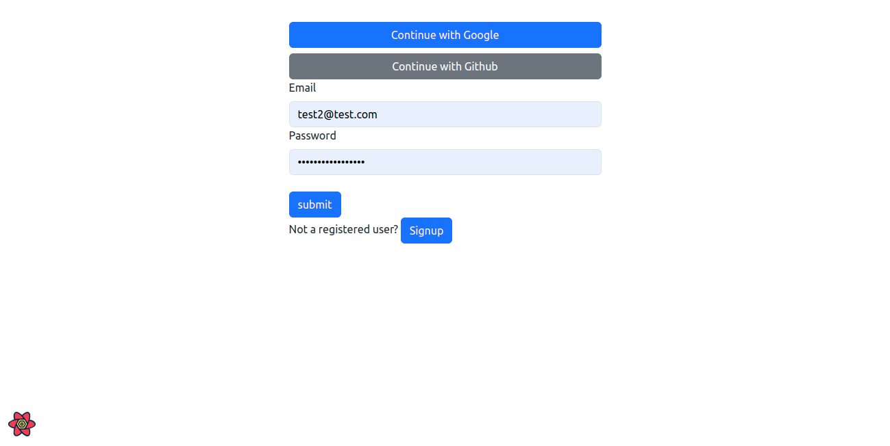
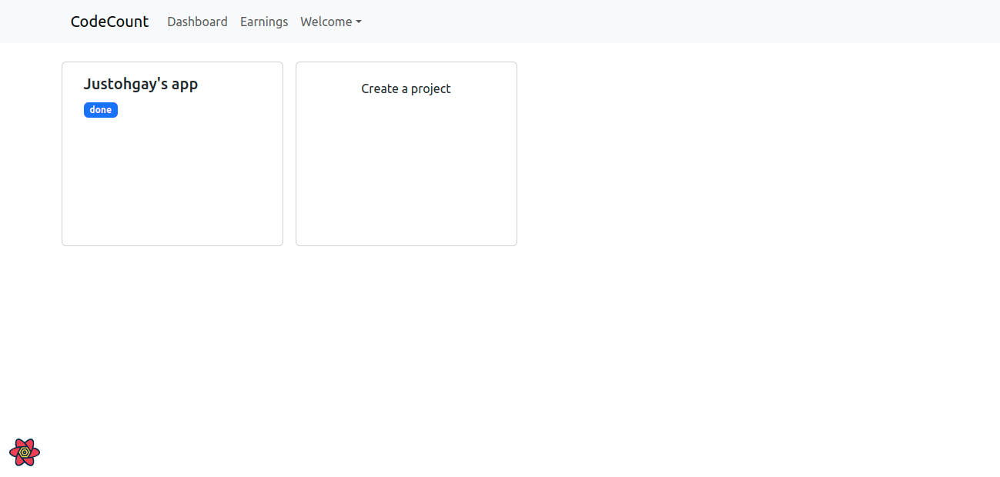
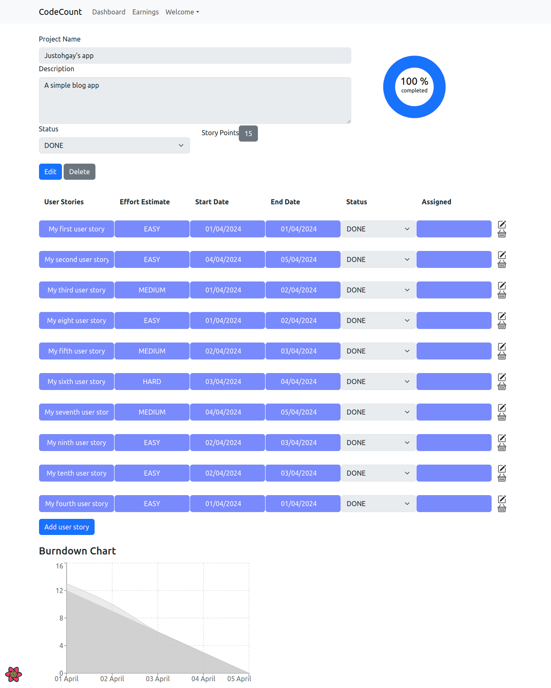

# CodeCount
| Tagline  |  Count Every Project, Every penny, Every possibility |
| --- | ---|
| author | [@allisonoge](https://github.com/allisonoge) |
| version | 0.0.0 |
| comment | in partial fulfilment of the requirements for the SWE program at ALX |

**Executive Summary**: a web-based tool under the belt of freelance developers for tracking projects and managing finances meticulously. It can help a developer estimate when the work will be completed and the cost by showing the amount of work remaining over time. CodeCount is especially useful for short-term projects like the ones ALX students engage in regularly as it is an excellent way to represent your progress against time visually.

## MVP Solution

There are 4 major features fully defined in the following trello board => [https://trello.com/b/whcmiUTd/codecount-project](https://trello.com/b/whcmiUTd/codecount-project)

## Screenshots (MVP Solution)

Auth page



Dashboard view (Projects)


Dashboard view (with charts - new project)


Dashboard view (with charts)


## Getting started

Run the following commands to get stated. The application uses `supabase` and the url and secret key should be specified in an `.env` file with the keys '`VITE_SUPABASE_URL` and `VITE_SUPABASE_KEY`'
```bash
git clone repo
cd codecount
npm install
npm run dev
```
